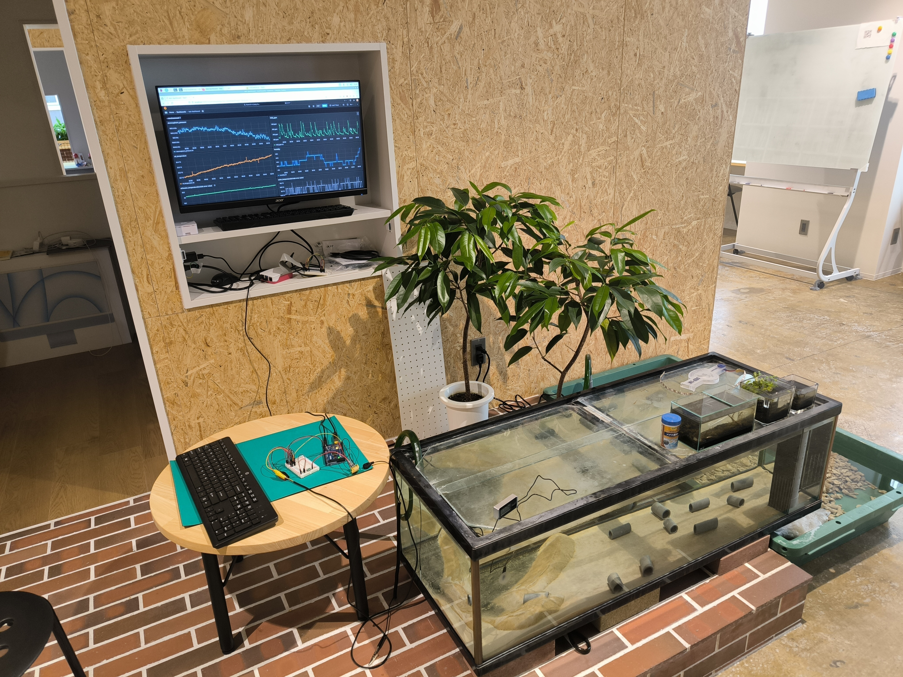
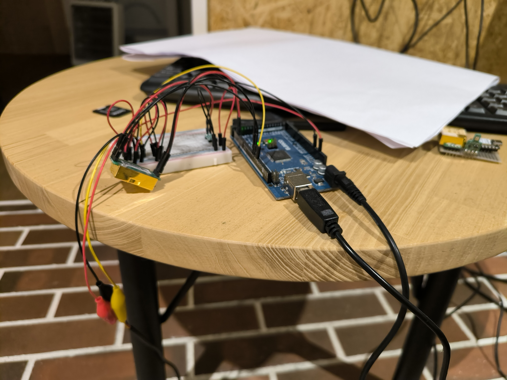

私は富山の出で、実家は漁港近くにある。海なし県に囚われた私を心配しているのか、祖母は私が帰省するたびに地場の魚を振る舞ってくれる。祖母が笑顔で「こちらの魚は美味しいだろう、新鮮さが違うから」と話してくれるたびに、私も魚のおいしさ以上に嬉しくなる。
ところで東京-地方漁港スシ議論という概念がある。日本で一番カネとヒトが集まる都市である東京に上等なネタも同じく一極集中するから地方の漁港近辺で食べるスシが新鮮で一番うまいというのは幻想であると主張する東京人と、普通に考えて釣りたてを食べるのが一番うまいだろと主張するその他[^1]の県民の対立である。これら主張の真偽はさておき[^2]、高速道路開通やコールドチェーンの発達によって群馬県の魚介事情は相当に改善された。もちろん群馬県の超巨大マーケットにアクセスするために物流システムが改善された訳ではなく、東京と日本海側を繋ぐためだ。話は変わるが、古来から抜荷の対策というものは難しいもので、港湾や鉄道ではコンテナの導入まで行方不明になる荷物が相当多かったらしい。
なにはともあれ日本海側の漁港で朝に採れた魚は翌日早朝のセリまでに東京に届き、その日のうちに飲食店や小売店に並ぶ。また、漁港近辺のスーパーマーケットでは11時ごろからその日の朝に取れた魚が並び始める。少し話が戻るが、私の祖母は公務員を定年まで勤め上げた厳格な人で、何事も早め早めに済ませてしまう。例えば、私が帰省する2~3日前には魚を買っておいてくれるらしい。

---

本稿ではGITYで行われているクルマエビの海上養殖の環境監視システムの概要について示す。作成ガイド形式になっているのでエビを養殖したい方はどうぞ。このシステムは文字通り私一人の手によって[^3]一晩で作成されたためアラが多いかもしれない。ダシもよく出る。しかし、昨年9月から現在に至るまで24/365で特にトラブルなく運用できている。

## はじめに

まず、GITYのエビ養殖水槽に設置された監視システムはあくまでデモンストレーション用であり、構想/設計のごく一部であることを断っておく。このシステムは**無駄に**どこかの財閥系企業の鉱山監視システムや**無駄に**農研機構の通い農業支援システムを参考にして構築され、**無駄に**農業情報学会のUECSをjsonに改変したものを通信プロトコルとして使用している。これによって**無駄に**拡張性が高く、なにかの間違いでエビ水槽がGITYフロアを埋め尽くしたり群馬県庁の全フロアがいきなり植物工場と化しても問題なく対応可能である。信頼性が重要なら冗長構成の構築や産業用グレードのボードへの入れ替えも容易に可能である。更に、**無駄に**WifiやBLE,LoRaといった通信規格にも対応でき、室内の数メートルから屋外の数キロメートル単位でのセンシングも可能である。記録頻度とバーターにはなるが、年単位でセンサ端末の電池を保たせることもできる。完全にオフグリッドでシステム全体を動作させることも、データ基盤をクラウドに設置することも可能だ。
GITYの養殖水槽に置かれているのは最小構成を少しだけ拡張した、有線ベースのコンパクトなバージョンである。次に現物の写真を示す。（設計ミスあり。分かった方は直接対面で私まで！先着で素敵なプレゼント。）

***ふざけているのか？***

しかし現実のプロトタイピングなんてこんなものである。総務省のICTスタートアップリーグも書類通過した。ここで陰謀論者に朗報――政府は我々を監視していない。

## 構成概観

ラズパイにマイコンを繋いだだけ。私の名前を横断検索ツールに入れる[^4]のは少し話を聞いてからでも遅くは無いと思う。思い出してもらいたいが、日本の誇る産業機械もモーターをたくさん繋いだだけだし、ここ何年間もS&P500の好成績を支えてきたビッグテックの筆頭、Googleの製品も群馬県の高卒（私のことだ）をストーキングして広告をクリックさせるだけのものだ。

このシステムは大きく分けて2つ、大規模化する場合には3つの部分に分かれる。センサを制御するマイコン部分、マイコンから送られるデータを受信し蓄積する小型Linuxマシン、そして小型PCに蓄積されたデータを纏めるクラウドサーバないしメインマシンである。今回のシステムではマイコンを一つと小型Linuxマシンを一つのシンプルな構成になった。更に小さくしたい場合にはGPIOのあるRaspberry Piのようなマシンに直接センサを繋いでやればよい。
概要としては以下の図のようになる。

### センサー選定

なんでもよい。強いて言うなら、湿度センサを流通過程で湿度管理しているサプライヤは秋月だけしか確認できていないという情報があった。適当に測りたいものが測れるものを買う。今回はBME280、MH-Z19C、DS18B20などを使用する。DS18B20は使用しやすく加工されたものが、なぜか生のセンサと変わらない値段で販売されているため注意。BME系列のセンサは海外通販でお安いものも見つかる。好みで使い分ける。センサー選定の最も重要なポイントは値段や精度よりも使いやすいライブラリがあるかどうかだ。一番のコストは人件費！

### マイコン/通信規格

マイコンにもいくつかの種類がある。個人開発で使用しやすいのはArduinoファミリやESP32ファミリだろうか。今回は**無駄に**Arduino mega（の、互換機）を採用した。NANOでよい。またESP32によるwifi経由でのDBへのデータの直接投入や、LoRaモジュールを利用した低消費電力長距離通信などもテストしたが、今回は明らかにオーバースペックなので採用していない。マイコンとセンサをそれぞれいい感じに配線する。長期間運用する場合には面倒でもブレッドボードではなく基盤にはんだ付けしてやること。現代においてはブレッドボードと同じようにランドが繋がっている便利な基盤が市販されている。面倒な配線作業は不要だ。

### 小型Linuxマシン

実は！小型でもLinuxでもなくてもよい。何事にも全力で当たりたいタイプならフルサイズのデスクトップPCを採用しても特に問題ない。しかし、LoRaモジュールやセンサの接続、運用時間の長さ、供給体制などを考えると産業向けのシングルボードコンピュータが無難な選択だろう。

今回はRaspberry Pi4を採用した。国内ではPi5に給電するための電源が入手しづらいためだ[^5]。また、頻繁なMicroSDへの書き込みは寿命を縮めるため、RAMディスクにデータを蓄積して一定間隔で保存する運用か、組み込み向けグレードのSLCのものを使用するのがよいだろう。両方のアプローチを組み合わせてもよい。よくわからなければ「ドライブレコーダー用」と書いてあるMicroSDカードを選べば最低限なんとかなる。またRaspberry piにはH/W watchdog timerが組み込まれているため、これも忘れずに有効にしておくこと。watchdogを追加してくれるhatも市販されているので、そういったものを追加するのもよい。

このマシンでは3つのソフトウェアを動作させる。マイコンと通信してセンサのデータを受け取り、データベースに投入するソフトウェア。これは自作する必要がある。加えて、時系列データベースInfluxDBと可視化ツールGrafanaをインストールする。Dockerで動かしても、直接生環境に入れてしまってもよい。今回は面倒だったので生環境に入れた。
それぞれ適切にインストールして適当に連携させる。解説記事はGoogleで検索を行えば無数にヒットし、ChatGPTなりDeepSeekなりに聞けば入力するコマンドまで手取り足取り教えてくれるだろう。かつて先生とすら呼ばれたGoogle検索の威光は消え去り今ではググレカスという単語を聞くことも無くなった。現代社会において驚き屋がエーアイを称賛する鳴き声が朝の時報、検索サービスをググってもカスと揶揄する御宅の鳴き声が夜の時報となっていることからも分かるように実は両者は非常に近い行いでありGoogle検索は2019年にBERTと呼ばれる言語モデルを組み込んでいる検索の劣化は潜在的新規顧客の枯渇による戦略の変化つまり既存ユーザーが更に多く検索しないと有益なサイトにアクセスできなくすればPVが改善するというEnshittificationによる当然の帰結であり技術的な問題ではなく……

言うまでもないがAPIキーのたぐいは各種サービスに入力しないこと。Gitでプロジェクトを管理しているなら、gitignoreの設定も忘れないように。
マイコンとの通信にはシリアル通信を使用した。距離次第で規格を変えたり何かしら間に挟んだりするが、今回はデフォルトで問題ない。

すべてがうまくいけば、Grafana上で美しいグラフが見えるはずである。センサーを手で温めたり息を吹きかけてみよう。外部サービスと連携してアラートを飛ばす場合、Grafanaの機能を利用するアプローチとPythonでセンサデータを受け取るタイミングで行うアプローチがある。自分の使用したいサービスが対応しているほうを選ぼう。

### クラウド基盤、メインマシン

センサー群をまとめるマイコン、をまとめる小型Linuxマシン、をまとめるために必要。これを導入する場合、先述のラズパイはIoTゲートウェイないしエッジ機器的な立ち位置になる。強力な回線で接続され給電にも不自由しない、例えば工場のような場所で運用するなら単純な機能に特化させてもよいし、モバイル通信すら難しい山奥のような環境で運用するなら適当な処理を行わせてデータ量を減らしてから通信するようにしてもよい。Raspberry piは非常に強力な処理能力を備えており、物体認識タスクを1fps前後でこなす程度ならお茶の子さいさいである。何にせよ大規模になると種々の制約からセンサから送られるデータを一時的にストックする必要がどうしても出てくる。

今回は不要だ。

## 終わりに

機械に見守られながらエビはすくすくと育ち、肉眼での視認も難しい稚エビから立派な天ぷらサイズにまでなった。
彼らの知能は驚くほど高く、なんとGITYにたむろして不定期に奇声をあげる迷惑集団[^6]よりも規則正しい生活リズムを有している。人類滅亡の後には覇権を握っていることうけあいである。
人類をとりまく自然環境は日々厳しさを増している。私もここ最近バイオマイクロマシン[^7]による免疫攻撃に苦しんでいる。たぶん来年くらいに滅ぶだろう。
そんな自然環境も鑑みて、次回はいよいよ不安定化する気象状況に左右されず食料を供給する唯一の方法について書いていく。

## 注釈

[^1]: 栃木県、群馬県、埼玉県、山梨県、長野県、岐阜県、滋賀県、奈良県を除く。
[^2]: 群馬県には太平洋の魚と日本海側の魚が集中するから日本で最もうまいスシが食べられるというのが実際である。
[^3]: LLMの支援も受けていない。原理的にハードと開発環境のバージョン相性とかサイレントな仕様の破壊的変更とか私の配線ミスとかに対応できないためだ。更に言えば、あれには*はんだごてを握れない*という重大な欠陥がある。
[^4]: インターネット上の様々な検索窓にクエリを投入して結果を表示するツール。OSINTで使用されるユーティリティ。
[^5]: 財団のやつらが電源回路をケチったため5V5Aという変な電圧電流を要求する。普通のPD対応機器で給電すると3V5Aでハンドシェイクして一応動きはする。画像認識タスクあたりで全力を出すとシステムが落ちる。
[^6]: 彼らは群馬大学投石学部を名乗りジャンク、工具、専門書、きらら系漫画などを持ち込む、フロアの一部を不当占拠する、怪しいゼミを開催する、寸胴鍋で牛丼を煮るなどの悪行を繰り返している。
[^7]: 花粉。
