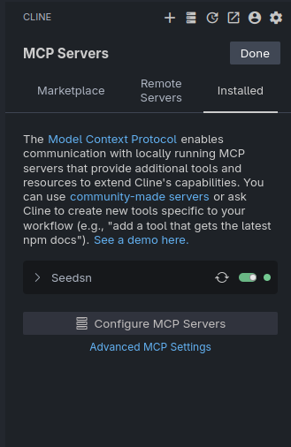
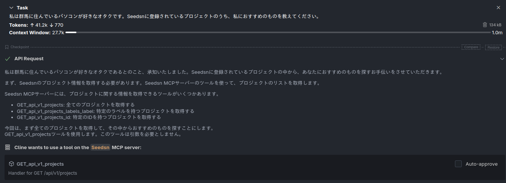
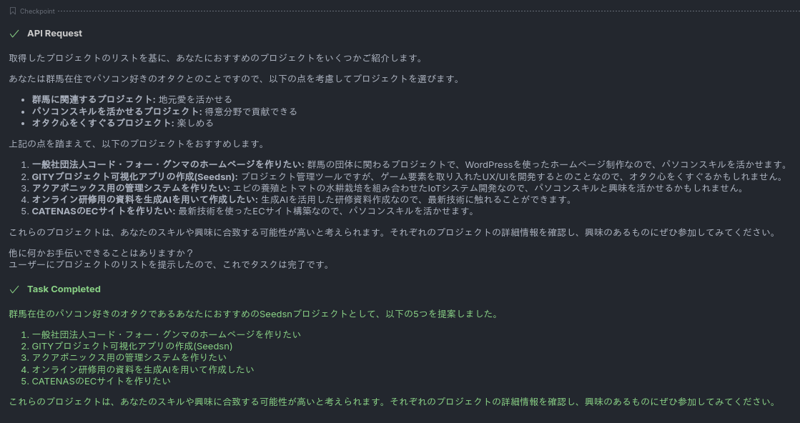

世間の技術の話題といえばLLMでもちきりになってしまいました。QiitaやZennのトレンドはMCP ServerやLLMの話題で溢れかえっています。

私はそんなAIに溢れかえっている今の風潮があまり好きではないのですが、全身逆張りオタクのような[^1]言動ばかりしていては世間に取り残されるのみです。

そんなわけで私もこの流行に便乗し、LLMくんのコミュニケーションツールであるMCP Serverを実装していきます。

## 事前知識のおさらい

### MCPとは? LLMのTypeCと呼ばれる謎の物

まず、「MCPとはなんぞや？」という疑問に答えましょう。

MCP（Model Context Protocol）は、LLMと外部のサービス/アプリケーション間で安定的かつ効率的に通信するために設計された通信プロトコルです。アプリケーション層のプロトコルであり、平たく言えば特定のJSONを返すREST APIサーバーです。

簡単に言えば「LLMと喋るためのUSB Type-Cケーブル」のような役割を果たします。

従来、LLMと外部サービスを繋げようとすると、OpenAI APIのような独自仕様のREST APIやWebSocket、果てはRPCのラッパーなど、実装者ごとにバラバラな通信方法が使われてきました。

MCPはこれを標準化し、「モデルとクライアント及び情報源の間でやり取りするメッセージの形式・流れ・エラー処理」を統一することで、LLMが外部サービスへアクセスしやすくなり、ハルシネーションを減らしたり作業を代行したりできます。

### MCP Serverとは

MCP Serverとは、このMCPプロトコルを話せるサーバー側の実装を指します。具体的には、

- LLMから要求された情報を提供する
- LLMに従って副作用を伴う特定の処理を行う

といった機能を備えたサーバーのことです。

MCPが実装された任意のアプリケーションと任意のモデルが通信できることにより、サービスを自由に接続できるようになります。IFTTTのLLM版というのがわかりやすい表現でしょうか。

とはいえ、MCPの仕様はそこそこ複雑です。

「じゃあ俺が今からMCP Serverの全プロトコル実装を書くぞ！」というのは、なかなか骨が折れます。

## ckanthony/gin-mcpはすごいぞ

MCP Serverが何をするものかというのがわかったところで早速作っていくわけですが、一からこのプロトコルを実装するのはちょっと面倒です。

以下のようなGolang用のライブラリが公開されてはいますが、これらを利用して構築しただけでは世間にあふれかえる記事と全く同じつまらないものになってしまいます。

私のような怠惰な人間はLLMによる効率化のための手間すら面倒なのです。

そんな私にうってつけのライブラリがこちら。[ckanthony/gin-mcp](https://github.com/ckanthony/gin-mcp)です。

このライブラリは名前の通り、みんな大好きGinフレームワークと組み合わせて「超お手軽にMCP Serverを立てられる」ことを目的に作られています。

MCPの中には情報を取得・操作するインターフェースを提供するToolと呼ばれるものがあります。LLMが実際に使えるTool(道具)というわけです。`gin-mcp`はGinで構築されたToolを一瞬で作成できます。

## GITYで開発されている実際のプロジェクトに導入してみた

### 元になるコード

以前にこのブログで、[Seedsnの技術スタックを紹介](/posts/20250116/seedsn-tech/)しました。今回はSeedsnにGinを導入していきます。

```go
config, err := conf.Get() // 設定を取得
if err != nil {
  return err
}

// Initialize the Gin engine.
slog.Info("Initializing the Gin engine")
engine := gin.Default()
setRoute(&engine) // 別の関数でルーティングを設定


// Run the server.
slog.Info("Starting the server")
if err := engine.Run(config.ServerPort); err != nil {
  return err
}
```

SeedsnのAPIサーバーの起動処理を行っている部分です。直接的な関与のない一部の処理を省略しています。

今回はこれに手を加えていきます。

### 追加するコード

適当な場所で以下のような関数を定義しましょう。やることはこれだけです。

```go
import (
	"github.com/catenas-g/seedsn/conf"
	mcpserver "github.com/ckanthony/gin-mcp"
	"github.com/gin-gonic/gin"
)

func setMCP(e *gin.Engine) {
	s:= mcpserver.New(e, &mcpserver.Config{
		Name: "Seedsn MCP Server",
		Description: "Seedsn MCP Server",
		BaseURL: "https://localhost:8080/",
	})

	s.Mount("/mcp")
}
```

設定の値はそれぞれ書き換えてください。`ckanthony/gin-mcp`は`gin.Engine`に対していろいろ加工をしてあげることでMCP Server化します。

関数を作成したら、これを実際に呼び出します。

```go {linenos=inline hl_lines=[11]}
config, err := conf.Get() // 設定を取得
if err != nil {
  return err
}

// Initialize the Gin engine.
slog.Info("Initializing the Gin engine")
engine := gin.Default()
setRoute(&engine) // 別の関数でルーティングを設定

setMCP(engine) // Call to set up the MCP server

// Run the server.
slog.Info("Starting the server")
if err := engine.Run(config.ServerPort); err != nil {
  return err
}
```

ルーティングの設定直後に`setMCP`を呼んであげるだけです。

```txt
INFO[0000] Starting conversion of 2 routes to MCP tools... 
INFO[0000] Processing route: GET /api/v1/projects -> OpID: GET_api_v1_projects 
INFO[0000] Processing route: GET /api/v1/projects/:id -> OpID: GET_api_v1_projects_id 
INFO[0000] Finished route conversion. Generated 2 tools. 
INFO[0000] [SSE] Creating new transport at /mcp         
INFO[0000] [Transport DEBUG] Registered handler for method: initialize 
INFO[0000] [Transport DEBUG] Registered handler for method: tools/list 
INFO[0000] [Transport DEBUG] Registered handler for method: tools/call 
INFO[0000] [Server Mount DEBUG] Defining GET /mcp route 
[GIN-debug] GET    /mcp                      --> github.com/ckanthony/gin-mcp.(*GinMCP).handleMCPConnection-fm (7 handlers)
INFO[0000] [Server Mount DEBUG] Defining POST /mcp route 
[GIN-debug] POST   /mcp                      --> github.com/ckanthony/gin-mcp.(*GinMCP).Mount.func2 (7 handlers)
03:36:46.997 INFO Starting the server 
[GIN-debug] Listening and serving HTTP on :8080
hayao@Hayao-XPS9350 ~/G/s/api (Hayao0819/mcp-server) [1]> 
```

サーバー起動時に見慣れないログが出力されれば。MCPサーバの構築は完了です。

## Clineから呼び出してみた

### ClineにMCP Serverを登録する

テストとしてClineから呼び出してみましょう。今回は呼び出しのモデルに`gemini-2.0-flash-001`を利用しています。

以下のようにMCP Server登録します。

```json
{
  "mcpServers": {
    "Seedsn": {
      "url": "http://localhost:8080/mcp",
      "disabled": false,
      "autoApprove": []
    }
  }
}
```



### 実際に呼び出してみる

次のようなプロンプトでSeedsnのAPIを使うように指示します。

```txt
私は群馬に住んでいるパソコンが好きなオタクです。Seedsnに登録されているプロジェクトのうち、私におすすめのものを教えてください。
```



どうやらちゃんとMCP Serverを使ってくれそうです。

APIの返答が色々と表示された後……



無事にちゃんと情報を取得して返してくれました。

## 終わり

僅か20行程度でMCP Serverと進化させることができました。エンドポイントやハンドラは一切触れず、`gin.Engine`に細工をしただけです。

残念ながら認証についての実装を行っていないのでプロジェクトの追加や削除といったことは行えませんが、それでもこの手軽さには驚きです。[^2]

もう少ししっかりと設定をしたうえで、Seedsnのプロジェクトを誰でもLLMで活用できるようにMCP Serverの実装を進めていけたらと思います。

皆さんもGinを使ったプロジェクトがあったらぜひ導入してみてください。それでは、また今度。

[^1]: 比喩表現であり私自身はｹｯｼﾃ
[^2]: 驚き屋さんになったのは初めてなのですが、うまくできていますか？
