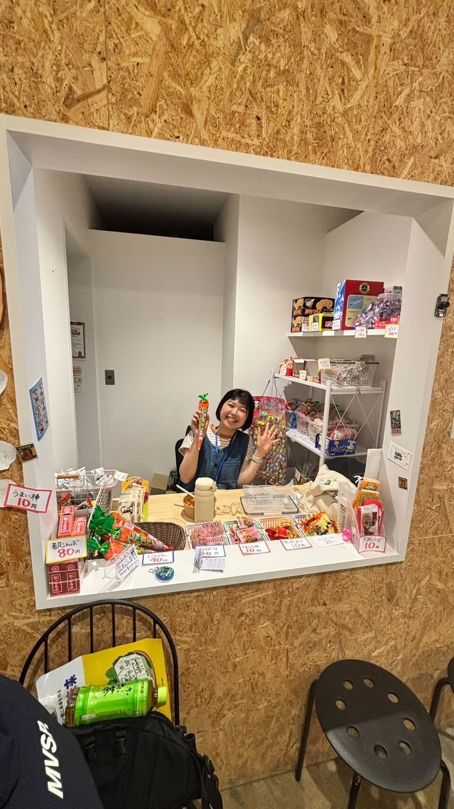
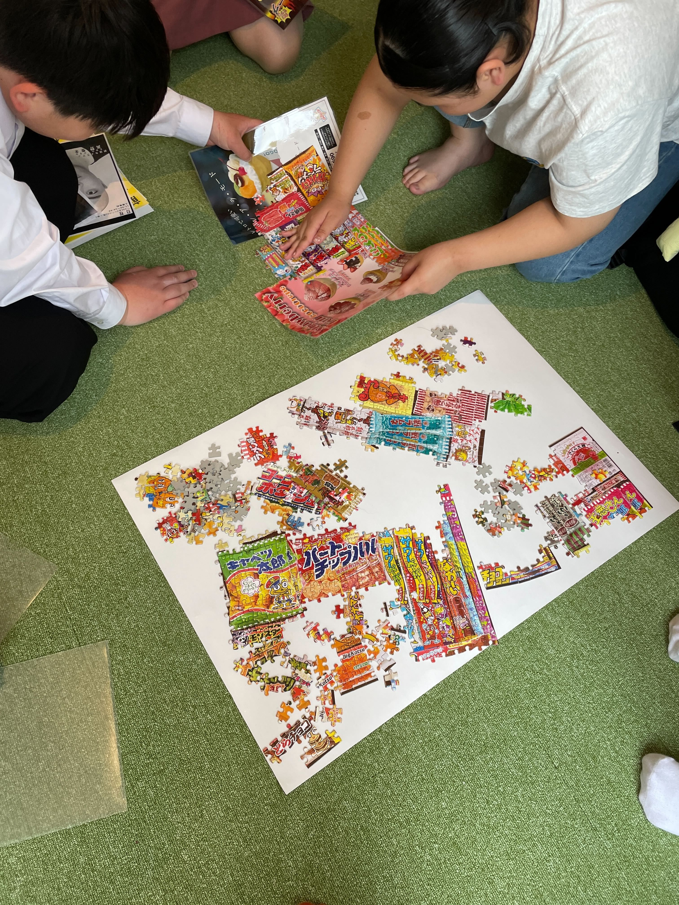
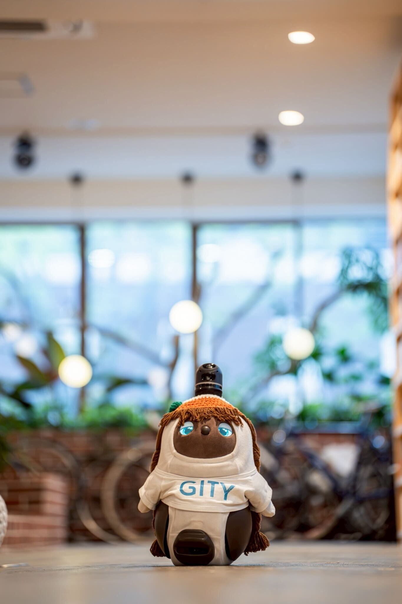

## 初めまして

今年2月から株式会社CATENASで働いています。いでまです。よろしくお願いします！aaaaaa
GITYで過ごす毎日が楽しくて仕方ないです＾＾

### 簡単に自己紹介

*   名前：いでま
*   年齢：24歳
*   趣味：イベント企画
*   特技：手話／打楽器／音速飯店（ボードゲーム）
*   座右の銘：死ぬこと以外かすり傷
*   マイブーム：働き方を模索しながら働くこと

### なんの仕事してるの？

GITYでの教育事業「Socius（ソキウス）」の運営、駄菓子屋「ひびのば」の運営・インフルエンサーをしています。
誰もが主体的に学び続けることができる社会をつくるために、さまざまな角度から活動を広げていくこの仕事が楽しいです！

### Sociusのミッション

Sociusはいわゆる学習塾とフリースクールを運営しています。
「いわゆる」と付けたのは、この「塾」「フリースクール」というラベリングがイメージを操作してしまっているんじゃないかと考えたからです。

Sociusのミッションは"出会い、繋がり、誰もが”共育”の主人公。“

学校に「行かない」という選択が、ネガティブな不登校のイメージではなく、
シンプルな、新たな選択肢として捉えることが当たり前になるような社会を作りたいと思っています。

学習塾も同じで、従来の知識詰め込み型の塾ではなく、勉強に向かうモチベーションを高めることを目的とした、生徒と大学生講師間での”学び合い”を重視しています。

### 駄菓子屋ひびのばってなに？

大学生と一緒に運営している駄菓子屋さんです！今年の4月25日にオープンしました！

*   営業日：毎週火曜日・金曜日
*   時間：15:00-18:00
*   場所：[群馬県前橋市南町３丁目74−１１](https://g.co/kgs/FPmur5c)
    まだ営業日が少ないのですが、徐々に増やしていけたらと思っています！
    また、店舗数も増やして、いろんな地域の方へ駄菓子屋で生まれるコミュニティを楽しんでもらえるようにしたいなと思っています！

#### SNSも頑張ってます

ひびのばは[Instagram](https://www.instagram.com/hibinoba_dagashi/reels/)で発信をしています！
このアカウントも、県内の大学生たちと一緒に作っています！SNSマーケティングを学生同士で学び合える場として、日々奮闘中です！
一見、SNSの世界はキラキラしているように見えますが、緻密に分析と改善を重ねている学生たちの姿は本当にたくましく、リスペクトが止まりません！
SNS班の子達が作ってくれた台本の言葉ひとつひとつの意味や意図を読み解きながら、一生懸命頑張っているのでぜひチェックしてみてください！お店にも遊びに来てくださいね〜！

### 仕事の中で大事にしていること

#### 自己決定の機会をなるべく多く作る

学校に通わないという選択をとった子たちは、社会の中で学んでいくということであり、一つ一つの意思決定がその後の人生に大きな影響を与えることがあります。
日々の小さな決断も、学校に行く・行かないという大きな決断も、子どもが「自分で決めたのだから頑張ろう」と思えるような環境づくりを重視していきたいと思っています。

駄菓子屋の運営でも、Sociusの学生と関わるときでも、大事にしていることは共通しています。学生の主体性を尊重し、やりたいこと・学びたい学習が実現できる場所にしてほしいという思いのもと、活動しています！

どこまで自分の意見を伝え、どこからどうやって学生に任せるのか。

真のリーダーシップとか、コミュ力とか、いろんなテーマで対話を繰り返し、学びでお腹いっぱいになるような、そんな毎日です…！

## 終わりに

GITYを運営する株式会社CATENASでの生活について、考えていることなどざっくばらんに書かせていただきました。いかがでしたか〜！

GITYは今日も、平和です。どれくらい平和かというと、学生が甘食を分け合いっこしてくれたり、その横で急須でお茶を入れてくれたり、それくらい平和です。あと社会人の方がかわいい駄菓子をちょこちょこ買って交流してくれるのも、嬉しいです、萌えます！＾＾

GITYに来てから約４ヶ月。穏やかさと新しさ、面白さを兼ね揃えたすげえ居場所だなと思います！
これからも、楽しみながら学びを積み重ねて成長していけるよう頑張ります！

最後まで読んでいただきありがとうございました！

<!-- markdownlint-disable no-alt-text -->

