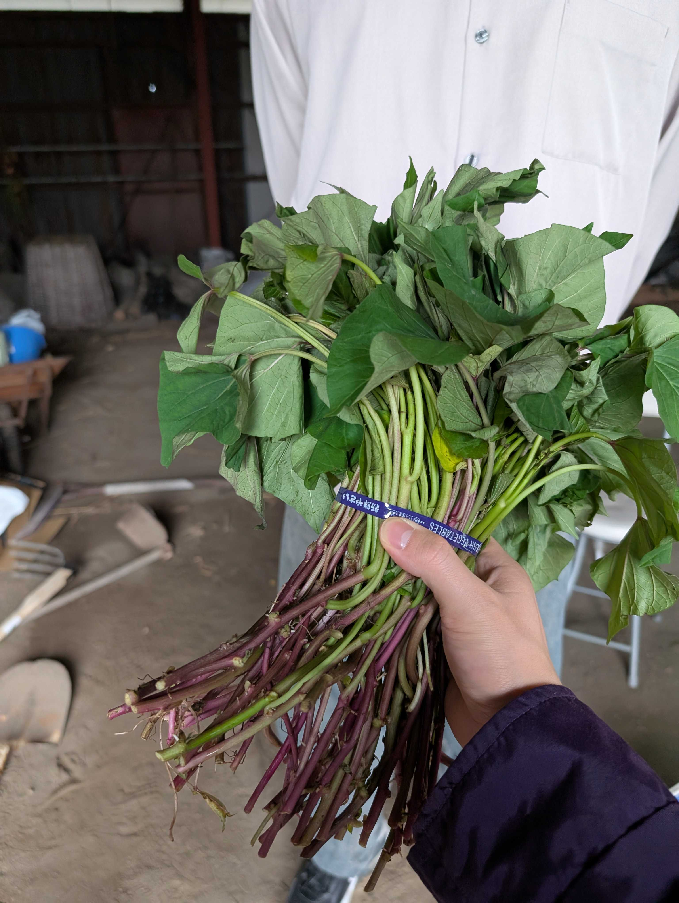
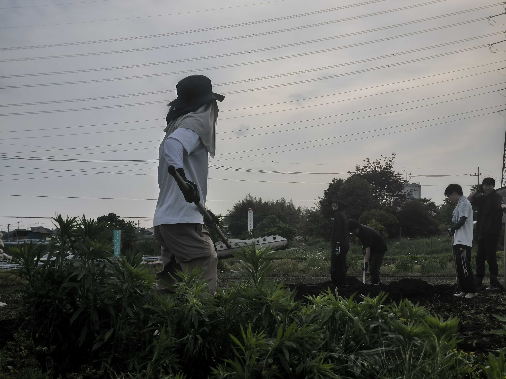
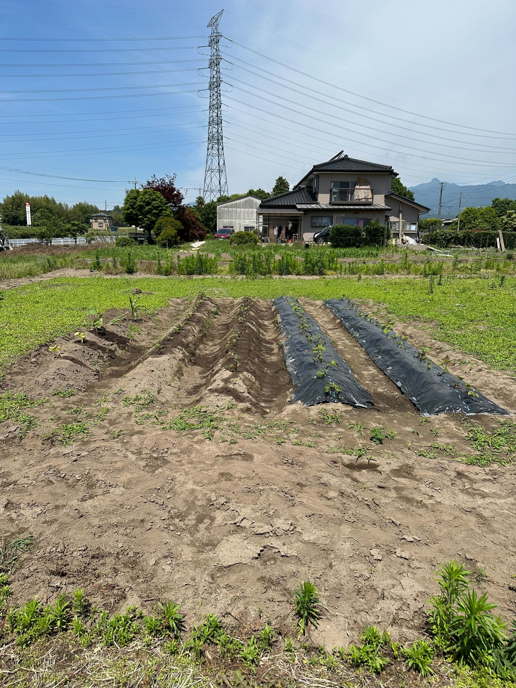
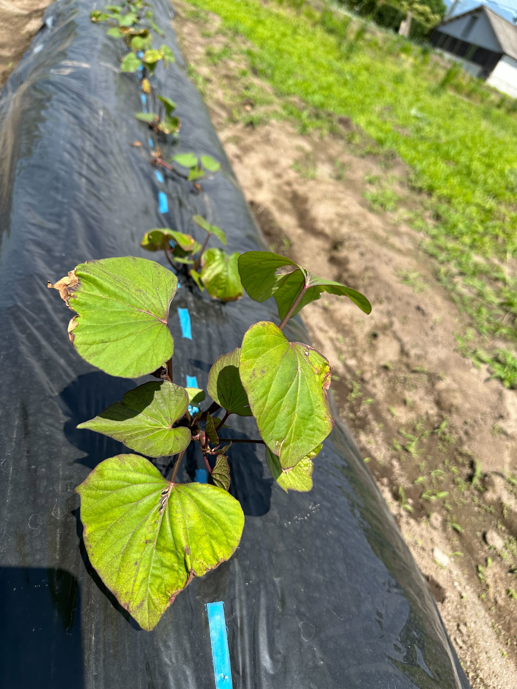

## これはなに

いま、クーデターがアツい。[^1]ある技術書[^2]によれば、統制の取れた実力組織と専門職、特に電気・情報系を用意し、電撃的に国家中枢とメディア設備を奪取すればよいらしい。コトが終わったら国家運営を実質的に担う官僚組織を懐柔することも忘れずに。ところで、GITYには専門職の豊富なリソースが揃っている。発達したAI技術は硬直した官僚機構よりも素晴らしい働きをするだろう。これは巨額の投資を受けるAIベンチャー企業のCEOたちの発言を引用するまでもなく明らかなことだ。[^3]**あとは実力だけ。**

## はじめに

今、日本の食料安全保障は危機に瀕している。農家の平均年齢はおおよそ68歳であり[^4]、定年退職をきっかけにして就農した高齢者ですら、農家コミュニティの中では”ワカモン”として扱われる現状がある。従来的な農家の経営体には当然限界が来ており、農家の戸数は減少を続けている[^5]。とうちゃんが死んじまったから、もう体力が/腰が限界だから、トラクターが壊れたから、太陽が眩しかったから、離農した。  
直近に起こったイベントに目を向けよう。ロシアのウクライナ侵攻以降、肥料価格は過去に例を見ないほど高騰した。農家はさらなる適正施肥を求められ、一層効率的な経営を求められている。[^6]南海トラフ巨大地震の予測以降、米価の高止まりが続く。令和の米騒動とまで名前が付き、一躍巨大政局にまでなった。[^7]  
このような現状に対し、地方から食料安全保障の一翼を担おうという動きが生まれるのは当然だろう。とにかくカロリーベースだ！育てるのはイモ類！チャラチャラしたルッコラとかアイスプラントとか、そういうよくわからん草は育てん！

## 準備

まずは土と苗を用意する。これは材料と設計図にあたる。土は植え付けのしばらく前までに施肥を行い、よく耕す。団粒構造を形成することが望ましいが、必須ではない。苗は種苗店に事前に注文しておく。必要なぶんだけを購入すること。苗は自然の中に普遍的に存在するから不要である[^8]、という都合のいい話はない。  
サツマイモの苗は茎の形で販売される。成長点が無事ならばとりあえずよいので、葉がしおれていても問題はない。買ってすぐ植え付けないならば、ビニール袋を掛けて蒸散を抑制し冷暗所に仮置きするのが良いだろう。

畝の作成や植え付け時には特に理性が必要というわけでもない[^9]ので、徹夜でぼけた頭でも十分作業可能だが、熱中症には十分注意するように。電解質と水分を準備しよう。どれだけ扱いにくいワーカーであっても、この炭素生命体を使うしかない……

## 畝の作成/マルチング/植え付け

畝を作成し、マルチで覆い、苗の植え付けを行う。この作業に熟練することによって、貴方がたは来たるべきAI地方幕府時代において然るべき地位を占めることができる。WIRED読者[^10]がわかりやすいように言い換えよう。大半の労働者が失業する時代ーーホワイトカラーがAIエージェントに、ブルーカラーがヒューマノイドロボットに置き換えられ[^11]、あらゆる機械がアデノシン三リン酸ではなくエレクトロンによって駆動するニューラルネットワークによって制御されるようになった時代[^12]においても、おまんまの食い上げにはならない、ということだ。  
具体的に考えていこう。高精度な位置情報サービスが広く提供され、自動運転技術も飛躍的に飛躍した現代において、重機を自動運転して省力化を図ることはごく自然な論理の帰結である。実際にダムの建設現場などにおいてすでに実用化されており[^13]、当然農業分野においても実証実験が進んでいる。貴方の畑が十分に広ければ導入できるだろう。トラクターで外周を1周ぶんを人力で運転しなくてはならない[^14]としても、労力を削減できるくらいに広い畑を持っているならば、だが。コストをペイできるかは更に別の問題だ。[^15]

汎用人型ロボットに畑を耕させる？何を言っているのかをまず理解しよう。これは不均一なソフトマテリアルの上を二足歩行する可動部の塊に防水防塵機能をつけて重量物を振り回させたいという要求だが、無理だ。デジタルツイン内で加速/並列してAIに制御を学習させるとか、もはやそういう次元の話ではない。無理なもんは無理にゃ！
農作業の具体的なやり方についてはここでは取り扱わない。YouTubeでも見とけ！[^16]実際のところ、この手の作業はマニュアル化するには細かすぎる経験知が大量に必要なので見て覚えるのが一番早い。テキストですべてを説明してほしいオタクくんには難しいわけである。あなたを土に植えるわ。生まれ変わりなさい。[^17]土を掘り上げて畝を作成する際に、高畝だからといって深く掘る必要はない。群馬県の大半の畑では改質されている層の下に固く締まった黒ボク土がある。[^18]改質された層がない？それは可哀想に……リン酸を主体に施肥を行うのが良いだろう。

## 終わりに

未曾有の少子化を背景に、人手不足が声高に叫ばれる昨今。地方自治体も当然その影響を受け、特に土木職の充足率は驚くほど低い[^19]。民間セクタに目を向けても同様、土木の現場を担う人材の確保は年々難しくなっている。[^20]世界的なインフレや通貨変動、自由貿易の後退などにより、施工費は前例のないレベルに高騰している。[^21]これらの要因が合わさり、地方のインフラを維持することは難しくなりつつある。ひとたび臨界点に達すれば、放棄される地域も出てくるだろう……現段階の世論を参照しても、現実的な選択肢として受け入れられ、大きな反発もないことが予期できる[^22]。スマートシティ構想は糖衣（ドラジェ）にすぎない。

___

つまり：地方に中央政府の支配が及ばなくなる。あるいは、介入が遅れる。ここに我々の勝機がある。
インドア派のもやしっ子ばかりだが、エレベーターでなく階段を使う体力はある。[^23]みな気のいい奴らばかりだ。牛乳も飲んでいる。[^24]当然、年寄り連中に遅れを取るつもりはない。もはや事態は取り返しの付かないところまで来ているのだ。我々が、自らの手で地方を創生する。君たちにも畑を耕してもらうことになるだろう。

## 告知

GITY農業はシリーズものです。次回作をお楽しみに！

[^1]: 諸説ある。 https://jp.reuters.com/world/korea/TUWACF5E25K7TKFPRB4DGEV5MA-2025-04-14/

[^2]:技術書にしては珍しく、[中公新書から出ている。](https://www.chuko.co.jp/bunko/2019/06/206751.html)

[^3]: イーロン・マスクの米政府効率化省による取り組みとその[結果](https://www.bbc.com/japanese/articles/c3wdznlnl2wo)を見れば明らかだろう。

[^4]: [農林水産省 農業労働力に関する統計](https://www.maff.go.jp/j/tokei/sihyo/data/08.html)

[^5]: [農林水産省 経営体に関する統計](https://www.maff.go.jp/j/tokei/sihyo/data/07.html)

[^6]: [土壌分析と有機物で肥料コストを抑えよう！適正施肥のススメ](https://agriport.jp/information/ap-2475/)

[^7]:[ニッセイ基礎研究所　令和の米騒動が起きた背景と農業の現状－米の価格高騰はなぜ起きた?](https://www.nli-research.co.jp/report/detail/id=82236?site=nli)

[^8]: seminarium

[^9]: 今回は種子ではなく苗を使用するためだ。(ationes seminales)

[^10]:君たちのことだ。

[^11]: [三菱総合研究所 ヒューマノイドロボットへの期待：社会実装される5つの意義](https://www.mri.co.jp/knowledge/column/20250609.html)

[^12]: [ここ](https://www.youtube.com/watch?v=jRLDPsoag6k)に大変わかりやすい動画がある。

[^13]: 数年前から様々な工程が自動化されて現場に導入されている
	[成瀬ダムで自動化施工システムによる「現場の工場化」を実現](https://www.kajima.co.jp/news/press/202310/13c1-j.htm)
	[ダムコンクリート自動打設システム](https://www.shimz.co.jp/solution/tech361/index.html)

[^14]: コンバインなら外周3ぶんは手動運転になる。一部に手動運転が必要であることはカタログの隅っこの小さい文字とか[規制省庁のガイド](https://www.maff.go.jp/j/nousin/noukan/tyotei/kizyun/attach/attach/pdf/tebiki-71.pdf)とかに書いてある。最新機種は若干マシになったらしい。

[^15]: [三菱総合研究所 日本のスマート農業はなぜ普及が進まないのか？](https://www.mri.co.jp/knowledge/opinion/2025/202503_3.html)

[^16]: [このような動画が有限可算個存在する。](https://www.youtube.com/watch?v=pZetzJfzfU0) 無限と言うとグーで殴られる本当にひどい環境にいます。

[^17]: 私は神農信仰が好きだ。

[^18]: 農研機構が日本土壌インベントリーという本当に素晴らしいサービスを[リリース](https://soil-inventory.rad.naro.go.jp/)している。

[^19]: 2021年時点の分析で [これ](https://www.jri.co.jp/MediaLibrary/file/report/researchreport/pdf/12484.pdf) であり、[例えば中国地方の自治体はすべて確保に困難を抱えている。](https://www.chugoku-np.co.jp/articles/-/475814) 国家公務員ですら採用予定人数を[確保できていない。](https://www.nikkei.com/article/DGXZQOUC286JS0Y4A820C2000000/)

[^20]: [リコー  土木業界の人手不足を解決する方法と成功事例｜生産性向上のカギとなるポイントも紹介](https://www.ricoh.co.jp/magazines/workstyle/column/civil-engineering-shorthanded/)
	しかし、"アニキ"について現場に行くだけで年収600万いった時代のそれを維持できる訳がないだろう。

[^21]: [みずほリサーチ&テクノロジーズ 　建設分野における物価等動向について](https://www.mizuho-rt.co.jp/publication/report/2024/construction2410_01.html)　今は更に高騰している。

[^22]: [これ](https://x.com/search?q=%E8%83%BD%E7%99%BB%E5%8D%8A%E5%B3%B6%E5%9C%B0%E9%9C%87%E3%80%80%E3%82%B9%E3%83%9E%E3%83%BC%E3%83%88%E3%82%B7%E3%83%86%E3%82%A3&src=typed_query&f=top)を見てほしい。国民の皆様の素晴らしい意見が拝聴できる。

[^23]: GITYはGSレジデンスの二階に位置しているが、エレベーターは止まらない。

[^24]: 本当は「毎日豆乳も飲んでいる」としたかったが、最近GITYに宅配牛乳が導入されたため改稿された。話は変わるが牛乳（やコーラ）を飲むのか、それとも植物由来の代替ミルクを飲むのかによって深刻な対立を起こしている国もあるらしい。その国の首脳は白い家に住んでいることで知られている。
